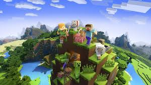
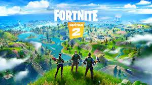

<!DOCTYPE html>
<html lang="ca">
<head>
    <meta charset="UTF-8">
    <meta name="viewport" content="width=device-width, initial-scale=1.0">
    <meta http-equiv="X-UA-Compatible" content="ie=edge">
    <title>Geni64Web</title>
    <link rel="stylesheet" href="style.css">
</head>
<body id="body">
    

        <header id="header">
            <h1>Geni64Web</h1>

            <h2>Jocs i programacio</h2 id="h2ex">
        </header>
    
        <nav id="menu">
            <ul>
                <a href="index.html">Inici</a>
                <a href="routes/download.html">Descarragues</a>
                <a href="routes/contact.html">Contacte</a>
            </ul>
        </nav>

        <section>
            <article id="mine">
                
                <h2>Minecraft</h2>
                
Minecraft és un gran joc, ja que podem construir tot el que ens imaginem: una mansio, una picina gegant, etc... A més a més també tenim mods, ho sigui com extensions que encara fan el joc més divertit.

                <footer>
                    <a href="routes/mine.html">Llegir més</a>
                </footer>
            </article>
            <article id="html">
                
                <h2>Html5</h2>
                
Html5 és el llenguatge més usat per construir pagines web. Aqui et deixem un toturial on podem apendre els conceptes basics d'aquest llenguatge tant intresant. Espero que us agradi !!!

                <footer>
                    <a href="routes/html.html">Llegir més</a>
                </footer>
            </article>
            <article id="fort">
                
                <h2>Fortnite</h2>
                
Fortnite ara mateix és un dels jocs més populars del mon. Aquest joc consisteix a matar els enemics i que no en quedi cap. També hi han altres modes de joc per exemple: modo creativo (et crees una illa a la teva manera), etc...

                <footer>
                    <a href="routes/fort.html">Llegir més</a>
                </footer>
            </article>
        </section>

        <aside>
            <article id="sid">
                <h3>I recordeu...</h3>
                <h3></h3>
                <h3>Si alguna cosa voleu aconsegir</h3>
                <h3>paciencia i esforç tindreu que tenir.</h3>
            </article>               
        </aside>
        
        <footer id="footer">
            <article id="links">
                <h3>Links:</h3>
                <ul id="ulli">
                    <a href="https://www.google.cat">Google</a>
                    <a href="https://www.youtube.com">Youtube</a>
                    <a href="https://www.twitter.com">Twitter</a>
                    <a href="https://www.facebook.com">Facebook</a>
                </ul>
            </article>
            <h3>Drets reservats 2019-2021</h3>
        </footer>
    
    
</body>
</html>
